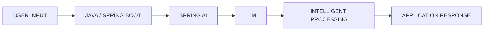

<div align="center">

<!-- ===================== HERO ===================== -->


<br/>

<a href="https://github.com/ARBiradar">


</a>

<br/>


<br/><br/>

<a href="https://github.com/ARBiradar">

</a>

</div>

---

# `01 // SYSTEM.IDENTITY`

```text
┌───────────────────────────────────────────────────────────────┐
│                    ADARSH_BIRADAR@ENGINEERING                 │
├───────────────────────────────────────────────────────────────┤
│ ROLE        : Java Full Stack Developer                       │
│ SPECIALTY   : Backend Engineering + Intelligent Applications  │
│ AI          : Spring AI + Prompt Engineering + GenAI          │
│ FRONTEND    : React + Next.js + TypeScript                    │
│ DATABASE    : MySQL + MongoDB + Oracle SQL                    │
│ DEVOPS      : Docker + CI/CD + Jenkins + Kubernetes           │
│ CLOUD       : Azure + AWS + GCP                               │
│ BASE        : Bengaluru, Karnataka, India                     │
│ STATUS      : BUILDING • LEARNING • SHIPPING                  │
└───────────────────────────────────────────────────────────────┘
```

> I’m a Java Full Stack Developer focused on building applications where **strong backend engineering meets intelligent features**.

My core development stack revolves around **Java, Spring Boot, REST APIs and React**, while I’m actively exploring **Spring AI, LLM integration, Generative AI, cloud platforms and DevOps**.

My engineering goal is simple:

### **Build software that is scalable, secure, intelligent and maintainable.**

---

# `02 // ENGINEERING.STACK`

## ☕ Backend Engineering


`Core Java` · `OOP` · `Collections` · `Multithreading` · `Exception Handling`
`JDBC` · `Hibernate` · `Spring Framework` · `Spring Boot` · `Spring Security`
`REST APIs` · `Microservices` · `JWT` · `Backend Service Development`

---

## ⚛️ Frontend Engineering


`HTML5` · `CSS3` · `JavaScript` · `TypeScript`
`React` · `Next.js` · `AngularJS` · `Tailwind CSS` · `Bootstrap` · `Vite`

---

## 🧠 AI & Generative AI


`Spring AI` · `Prompt Engineering` · `Generative AI`
`LLM Integration` · `AI-Assisted Development` · `AI-Powered Applications`

### AI Engineering Direction



---

## 🗄️ Database Engineering


`MySQL` · `MongoDB` · `MongoDB Atlas` · `Oracle SQL`

---

## ☁️ Cloud & DevOps


`Docker` · `Git` · `GitHub` · `Jenkins`
`GitHub Actions` · `GitLab CI` · `CI/CD`
`Azure DevOps` · `Kubernetes` · `Terraform` · `Linux`

---

## 🛠️ Developer Toolkit


`IntelliJ IDEA` · `VS Code` · `Eclipse` · `Postman`
`Maven` · `npm` · `GitHub Copilot` · `Google Colab` · `Figma`

---

# `03 // PROJECTS`

<table>
<tr>

<td width="50%" valign="top">

## 🔐 SecureVote

### Blockchain-Based Secure Voting System

`Java` `Spring Boot` `React` `Vite`
`Blockchain API` `Smart Contracts` `JWT` `RBAC`

A security-focused voting application exploring:

* Blockchain-based voting
* Smart contract integration
* Merkle tree concepts
* Zero-knowledge proof simulation
* JWT authentication
* Role-based authorization
* Real-time result computation

**Focus:** Security-oriented architecture + blockchain integration.

**Repository:**
[SecureVote →](https://github.com/ARBiradar/Secure-Voting-System-Using-Block-Chain)

</td>

<td width="50%" valign="top">

## ✈️ MyTrip

### Full Stack Travel Booking Application

`Java 17` `Spring Boot` `MongoDB Atlas`
`React` `Next.js` `REST APIs` `Razorpay`

Features include:

* User authentication
* Flight search
* Booking management
* Payment integration
* RESTful backend services
* Database integration

A MakeMyTrip-inspired learning project developed during internship.

</td>

</tr>

<tr>

<td width="50%" valign="top">

## 🚨 CrowdAlert

### Real-Time Local Civic Issue Reporter

`Java` `Spring Boot` `Spring AI` `React` `WebSocket`

Current project focused on intelligent civic issue management.

```text
Citizen Report
      ↓
Location + Text + Photo
      ↓
Spring AI Classification
      ↓
Severity Detection
      ↓
Department Routing
      ↓
Live Map Update
```

Core capabilities:

* Pothole / garbage / water-leak reporting
* Text and photo submissions
* AI-based classification
* Severity prioritization
* Department routing
* Real-time map updates

**Status:** `ONGOING`

</td>

<td width="50%" valign="top">

## 📧 Email Onebox

### AI-Assisted Email Management

`TypeScript` `Node.js` `IMAP`
`Elasticsearch` `AI Categorization`

Implemented concepts around:

* Email synchronization
* IMAP integration
* Search
* Elasticsearch
* Intelligent email categorization

</td>

</tr>

<tr>

<td width="50%" valign="top">

## 📝 Java File I/O Notes App

### Desktop Notes Application

`Java` `Swing` `File I/O`

Includes:

* Desktop UI development
* File handling
* Notes management
* Java-based application architecture

</td>

<td width="50%" valign="top">

## 📊 RFM Analysis

### Customer Segmentation

`Python` `Pandas` `NumPy` `Google Colab`

Focused on:

* RFM analysis
* Customer segmentation
* Data processing
* Analytical insights

</td>

</tr>
</table>

---

# `04 // CURRENT.EXPLORATION`

```text
┌──────────────────────────────────────────────────────────┐
│              CURRENT ENGINEERING PIPELINE                │
├──────────────────────────────────────────────────────────┤
│                                                          │
│  [01] Advanced Java                                     │
│       └── OOP • JVM • Collections • Multithreading      │
│                                                          │
│  [02] Data Structures & Algorithms                      │
│       └── Problem Solving • LeetCode • HackerRank        │
│                                                          │
│  [03] Spring Boot                                       │
│       └── REST APIs • Security • Backend Architecture   │
│                                                          │
│  [04] Spring AI                                         │
│       └── LLM Integration • AI Workflows                │
│                                                          │
│  [05] Generative AI                                     │
│       └── Prompt Engineering • AI Applications          │
│                                                          │
│  [06] Cloud & DevOps                                    │
│       └── Docker • CI/CD • Kubernetes • Terraform       │
│                                                          │
│  [07] System Design                                     │
│       └── Scalable & Maintainable Architecture           │
│                                                          │
└──────────────────────────────────────────────────────────┘
```

---

# `05 // DSA.MODE`

### Daily problem-solving

I actively practice:

`Arrays` · `Strings` · `Linked Lists` · `Stacks` · `Queues`
`Trees` · `Graphs` · `Hashing` · `Recursion` · `Searching`
`Sorting` · `Dynamic Programming` · `Problem Solving`

### Coding Profiles

[](https://leetcode.com/u/AdarshRB/)

[](https://www.hackerrank.com/profile/adarshbiradar56)

---

# `06 // GITHUB.TELEMETRY`

<div align="center">


<br/><br/>


<br/><br/>


</div>

---

# `07 // PROFESSIONAL.EXPERIENCE`

### 💻 Java Developer Intern — CodeAlpha

**Dec 2024 – Jan 2025**

* Developed a Student Grade Tracker.
* Worked on an Online Quiz Platform.
* Practiced Java-based application development.

### 🚀 Full Stack Java Developer Intern — NullClass EdTech Pvt. Ltd.

* Worked on full-stack Java development.
* Developed a MakeMyTrip-inspired travel booking application.
* Worked on a blockchain-based voting system.

---

# `08 // CERTIFICATIONS`


---

# `09 // ENGINEERING.PHILOSOPHY`

```text
01  Write code the next developer can understand at 2 a.m.

02  Design for growth, not just for the demo.

03  Learn by building real things.

04  Treat AI as an engineered component — not magic.

05  Start with the problem, then choose the technology.

06  Strong fundamentals create strong systems.

07  Keep learning. Keep shipping. Keep improving.
```

---

# `10 // EDUCATION`

🎓 **Master of Computer Applications — MCA**
Acharya Institute of Graduate Studies
Bengaluru City University

🎓 **Bachelor of Science — BSc**
Mathematics · Physics · Chemistry
Rani Channamma University, Belagavi

---

# `11 // CONNECT.WITH.ME`

<div align="center">

<a href="https://github.com/ARBiradar">

</a>

<a href="https://www.linkedin.com/in/adarsh-biradar-87141a261/">

</a>

<a href="mailto:adarshbiradar56@gmail.com">

</a>

<a href="https://adarsh-portfolio-virid-six.vercel.app/">

</a>

</div>

---

<div align="center">

### ⚡ Building Intelligent Systems. Engineering Tomorrow. ⚡


</div>
